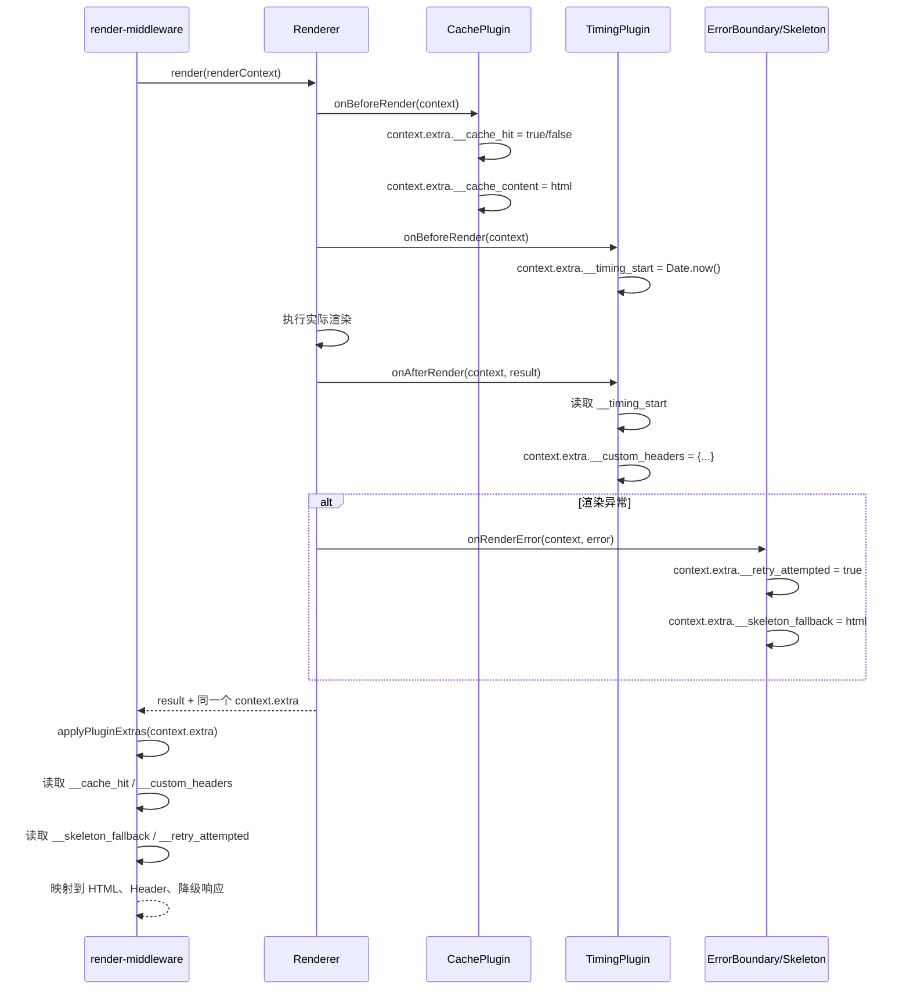

# 插件系统

Nami 的插件系统参考 Vite 的设计，支持构建、服务端、客户端三个阶段的全生命周期钩子。本文档从使用到原理，全面讲解插件机制。

读完后你将能够：
- 编写自己的 Nami 插件
- 理解三种钩子模式的区别和使用场景
- 利用 `context.extra` 实现插件间通信
- 正确管理插件的资源生命周期

---

## 1. 插件接口

每个插件必须实现 `NamiPlugin` 接口：

```typescript
interface NamiPlugin {
  name: string;              // 唯一标识
  version?: string;          // 版本号
  enforce?: 'pre' | 'post'; // 执行顺序控制
  setup: (api: PluginAPI) => void | Promise<void>;
}
```

### enforce 执行顺序

```
enforce: 'pre'  →  无 enforce（normal）  →  enforce: 'post'
  缓存插件              业务插件              监控插件
  (最先执行)                                (最后执行)
```

## 2. 编写一个插件

### 最小示例

```typescript
import type { NamiPlugin } from '@nami/shared';

export class MyPlugin implements NamiPlugin {
  name = 'my-plugin';
  version = '1.0.0';

  setup(api) {
    const logger = api.getLogger();

    api.onBeforeRender(async (context) => {
      logger.info('渲染即将开始', { url: context.url });
    });

    api.onAfterRender(async (context, result) => {
      logger.info('渲染完成', {
        url: context.url,
        duration: result.meta.duration,
        mode: result.meta.renderMode,
      });
    });
  }
}
```

### 完整示例：请求耗时统计插件

```typescript
import type { NamiPlugin, RenderContext, RenderResult } from '@nami/shared';

interface TimingPluginOptions {
  slowThreshold?: number; // 慢请求阈值（毫秒）
}

export class TimingPlugin implements NamiPlugin {
  name = 'timing-plugin';
  version = '1.0.0';
  enforce = 'pre' as const; // 在其他插件之前记录开始时间

  private slowThreshold: number;

  constructor(options: TimingPluginOptions = {}) {
    this.slowThreshold = options.slowThreshold ?? 3000;
  }

  setup(api) {
    const logger = api.getLogger();
    const config = api.getConfig();

    // 渲染前：记录开始时间
    api.onBeforeRender(async (context: RenderContext) => {
      context.extra.__timing_start = Date.now();
    });

    // 渲染后：计算耗时并上报
    api.onAfterRender(async (context: RenderContext, result: RenderResult) => {
      const start = context.extra.__timing_start as number;
      const duration = Date.now() - start;

      if (duration > this.slowThreshold) {
        logger.warn('慢请求检测', {
          url: context.url,
          duration,
          threshold: this.slowThreshold,
          renderMode: result.meta.renderMode,
        });
      }

      // 通过 extra 传递数据给中间件
      context.extra.__custom_headers = {
        'X-Render-Duration': String(duration),
      };
    });

    // 渲染错误：记录异常
    api.onRenderError(async (context, error) => {
      logger.error('渲染失败', {
        url: context.url,
        error: error.message,
      });
    });

    // 服务启动通知
    api.onServerStart(async ({ port, host }) => {
      logger.info(`TimingPlugin 已就绪，监听 ${host}:${port}`);
    });

    // 清理资源
    api.onDispose(async () => {
      logger.info('TimingPlugin 正在清理...');
    });
  }
}
```

## 3. 所有钩子一览

### 构建阶段

| 钩子 | 类型 | 说明 | 典型用途 |
|------|------|------|---------|
| `modifyWebpackConfig` | Waterfall | 修改 Webpack 配置 | 添加 loader/plugin/别名 |
| `modifyRoutes` | Waterfall | 修改路由配置 | 动态注入路由 |
| `onBuildStart` | Parallel | 构建开始通知 | 清理临时文件 |
| `onBuildEnd` | Parallel | 构建结束通知 | 生成额外文件 |

**Waterfall 示例 — 修改 Webpack 配置：**

```typescript
api.modifyWebpackConfig((config, { isServer, isDev }) => {
  if (!isServer) {
    config.resolve.alias['@components'] = path.resolve('src/components');
  }
  return config; // 必须返回修改后的配置
});
```

**Waterfall 示例 — 注入路由：**

```typescript
api.modifyRoutes((routes) => {
  routes.push({
    path: '/admin',
    component: './pages/admin',
    renderMode: 'csr',
  });
  return routes;
});
```

### 服务端阶段

| 钩子 | 类型 | 说明 | 典型用途 |
|------|------|------|---------|
| `onServerStart` | Parallel | 服务启动成功 | 初始化外部连接 |
| `onRequest` | Parallel | 请求到达 | 请求日志、鉴权 |
| `onBeforeRender` | Parallel | 渲染前 | 预处理、缓存检查 |
| `onAfterRender` | Parallel | 渲染后 | 指标采集、后处理 |
| `onRenderError` | Parallel | 渲染错误 | 错误上报 |
| `addServerMiddleware` | — | 注入 Koa 中间件 | 自定义中间件 |

**中间件注入示例：**

```typescript
api.addServerMiddleware(async (ctx, next) => {
  const token = ctx.headers['authorization'];
  if (!token) {
    ctx.status = 401;
    ctx.body = { error: 'Unauthorized' };
    return;
  }
  ctx.state.userId = verifyToken(token);
  await next();
});
```

### 客户端阶段

| 钩子 | 类型 | 说明 | 典型用途 |
|------|------|------|---------|
| `onClientInit` | Parallel | 客户端初始化 | SDK 初始化 |
| `wrapApp` | Waterfall | 包裹根组件 | Provider 注入 |
| `onHydrated` | Parallel | Hydration 完成 | 性能指标采集 |
| `onRouteChange` | Parallel | 路由切换 | 页面埋点 |

**wrapApp 示例：**

```typescript
api.wrapApp((app) => (
  <ThemeProvider theme={darkTheme}>
    <IntlProvider locale="zh-CN">
      {app}
    </IntlProvider>
  </ThemeProvider>
));
```

### 通用钩子

| 钩子 | 类型 | 说明 |
|------|------|------|
| `onError` | Parallel | 任意阶段的未捕获错误 |
| `onDispose` | Parallel | 插件销毁（热更新或停机） |

## 4. 钩子执行模式深度解析

### Waterfall（瀑布流）

```
initialValue → Plugin A → result A → Plugin B → result B → final result
```

- 前一个插件的输出是下一个的输入
- 如果插件返回 `undefined`，保持上一个值（容错）
- 单个插件失败：跳过该插件，用上一个值继续

```typescript
// PluginManager 内部实现
async runWaterfallHook<T>(hookName, initialValue, ...args): Promise<T> {
  let currentValue = initialValue;
  for (const handler of handlers) {
    try {
      const result = await handler.fn(currentValue, ...args);
      if (result !== undefined) currentValue = result;
    } catch (error) {
      this.handleHookError(hookName, handler.pluginName, error);
      // 继续下一个，不中断
    }
  }
  return currentValue;
}
```

### Parallel（并行）

```
                ┌→ Plugin A ──┐
args ──────────├→ Plugin B ──├→ Promise.allSettled → 统计失败数
                └→ Plugin C ──┘
```

- 所有处理器并发执行（`Promise.allSettled`）
- 单个失败不影响其他
- 失败数量记入日志

### Bail（短路）

```
args → Plugin A (返回 null) → Plugin B (返回 result) → 停止，返回 result
```

- 顺序执行，第一个返回非空值即为最终结果
- 后续处理器不再执行

## 5. 插件间数据传递：context.extra

`RenderContext.extra` 是一个 `Record<string, unknown>` 对象，是插件间以及插件与中间件之间的数据通道。同一个请求内，渲染器、各个插件钩子、`render-middleware` 拿到的是同一个 `RenderContext`，因此前面的写入可以被后面的阶段读取。



可以把它理解成一次请求里的“共享小黑板”：

- 插件在不同生命周期把数据写到 `context.extra`
- 后续插件或中间件从 `context.extra` 读取约定字段
- `render-middleware` 最终把这些字段映射为 HTTP 响应行为

### 约定的 extra 键名

| 键名 | 写入方 | 读取方 | 说明 |
|------|--------|--------|------|
| `__cache_hit` | cache 插件 | render-middleware | 缓存命中标记 |
| `__cache_key` | cache 插件 | cache 插件 / 调试日志 | 本次请求使用的缓存键 |
| `__cache_content` | cache 插件 | render-middleware | 缓存内容 |
| `__cache_etag` | cache 插件 | 下游中间件 / 调试 | 缓存条目的 ETag（如果 store 提供） |
| `__cache_created_at` | cache 插件 | 下游中间件 / 调试 | 缓存条目创建时间 |
| `__skeleton_layout` | skeleton 插件 | 渲染链路 / 调试 | 当前路由解析出的骨架屏布局 |
| `__skeleton_enabled` | skeleton 插件 | 渲染链路 / 调试 | 当前请求可使用骨架屏 |
| `__skeleton_fallback` | skeleton 插件 | render-middleware | 骨架屏 HTML |
| `__skeleton_fallback_used` | skeleton 插件 | 下游中间件 / 调试 | 已生成骨架屏降级内容 |
| `__custom_headers` | 任意插件 | render-middleware | 自定义响应头 |
| `__retry_attempted` | error-boundary 插件 | render-middleware | 是否已重试 |
| `__degradation_level` | error-boundary 插件 | 降级流程 / 调试 | 计算出的降级等级 |
| `__degradation_html` | error-boundary 插件 | 降级流程 / 调试 | 降级策略生成的 HTML |
| `__degradation_status` | error-boundary 插件 | 降级流程 / 调试 | 降级响应状态码 |
| `__degradation_reason` | error-boundary 插件 | 降级流程 / 调试 | 降级原因 |
| `__degradation_path` | error-boundary 插件 | 降级流程 / 调试 | 降级链路 |

## 6. 官方插件

本节以 `new NamiXxxPlugin(...)` 的类导出为主，这是类型最明确的推荐写法。`@nami/plugin-cache`、`@nami/plugin-monitor`、`@nami/plugin-request` 也保留了默认导出的历史工厂函数（如 `pluginCache({...})`），这些工厂会把少量旧字段转换成新配置；如果直接使用类导出，请按下面的真实配置项传参。

### @nami/plugin-cache

渲染结果缓存插件，适合给 SSR / ISR 页面做短期内存缓存，并可顺带生成 `Cache-Control` 响应头。

#### 基础用法

```typescript
import { NamiCachePlugin } from '@nami/plugin-cache';

new NamiCachePlugin({
  strategy: 'lru',
  lruOptions: {
    maxSize: 500,      // LRU 最大条目数，默认 1000
    ttl: 300,          // 单条缓存默认 TTL，单位秒；0 表示只受 LRU 淘汰影响
  },
  defaultTTL: 60,      // result.cacheControl.revalidate 不存在时的写入 TTL
  cdnConfig: {
    scope: 'public',
    maxAge: 0,
    sMaxAge: 60,
    staleWhileRevalidate: 86400,
  },
})
```

如果使用默认工厂函数，可以继续使用历史字段：

```typescript
import pluginCache from '@nami/plugin-cache';

pluginCache({
  strategy: 'lru',
  maxSize: 500, // 会转换为 lruOptions.maxSize
  maxAge: 60,  // 会转换为 lruOptions.ttl
})
```

#### 关键配置

| 配置 | 说明 |
|------|------|
| `strategy` | 内置缓存策略，支持 `'lru'` 和 `'ttl'`，默认 `'lru'` |
| `lruOptions` | LRU 策略配置：`maxSize`、`ttl`、`enableStats` |
| `ttlOptions` | TTL 策略配置：`defaultTTL`、`cleanupInterval`、`maxEntries`、`enableStats` |
| `store` | 自定义 `CacheStore`，提供后会忽略内置 `strategy`，可接 Redis 等外部存储 |
| `keyGenerator` | 自定义缓存键，默认是 `nami:page:${context.url}` |
| `cdnConfig` | 生成 `Cache-Control`，支持 `public/private`、`max-age`、`s-maxage`、`stale-while-revalidate` 等 |
| `defaultTTL` | 写缓存时的默认 TTL，默认 60 秒 |
| `enabled` | 是否启用插件，默认 `true` |

#### 工作原理

`NamiCachePlugin` 的 `enforce` 是 `'pre'`，会尽早执行。它在 `onBeforeRender` 中根据 `keyGenerator(context)` 查缓存，命中时向 `context.extra` 写入：

- `__cache_hit: true`
- `__cache_key`
- `__cache_content`
- `__cache_etag`
- `__cache_created_at`

未命中时写入 `__cache_hit: false` 和 `__cache_key`。当前服务端中间件会在渲染完成后读取 `__cache_hit` / `__cache_content`，用缓存 HTML 替换本次渲染结果，并加上 `X-Nami-Plugin-Cache: HIT`。也就是说，插件通过 `context.extra` 完成“命中标记与响应替换”，而不是在插件钩子里直接返回 HTTP 响应。

`onAfterRender` 会把 HTTP 2xx 的渲染结果写入缓存；如果本次已经是缓存命中，则不会重复写。写入 TTL 的优先级是 `result.cacheControl?.revalidate` 高于插件的 `defaultTTL`。如果配置了 `cdnConfig`，插件会用 `CDNCacheManager.generateHeader()` 生成 `Cache-Control`；如果没有 `cdnConfig` 但 `RenderResult` 带有 `cacheControl`，则生成 ISR 风格的 `s-maxage + stale-while-revalidate`。

#### 适用建议

- `lru` 适合控制内存上限的页面 HTML 缓存，靠最近访问淘汰旧内容。
- `ttl` 适合需要明确过期时间的缓存，会按 `cleanupInterval` 定时清理过期条目，并用 `maxEntries` 防止无限增长。
- 如果页面与登录态、地域、设备类型有关，必须自定义 `keyGenerator`，否则不同用户可能共享同一个缓存键。
- 内置 LRU / TTL 都是进程内内存缓存，多实例部署时缓存不共享；需要共享缓存时传入自定义 `store`。

### @nami/plugin-monitor

性能、错误和渲染状态监控插件，适合把服务端渲染指标、渲染错误、客户端 Web Vitals 批量上报到监控后端。

#### 基础用法

```typescript
import { NamiMonitorPlugin } from '@nami/plugin-monitor';

new NamiMonitorPlugin({
  endpoint: 'https://monitor.example.com/collect',
  performanceThresholds: {
    totalDuration: 3000,
    dataFetchDuration: 2000,
    renderDuration: 1000,
  },
  errorCollectorOptions: {
    sampleRate: 0.1,   // 普通错误 10% 采样；Error / Fatal 级别仍会采集
  },
  flushInterval: 30000,
  enableWebVitals: true,
  meta: {
    appName: 'my-app',
    appVersion: '1.0.0',
  },
})
```

如果使用默认工厂函数，历史字段 `reportUrl` 和 `sampleRate` 仍可用：

```typescript
import pluginMonitor from '@nami/plugin-monitor';

pluginMonitor({
  reportUrl: '/api/monitor/report', // 会转换为 endpoint
  sampleRate: 1.0,                  // 会转换为 errorCollectorOptions.sampleRate
})
```

#### 关键配置

| 配置 | 说明 |
|------|------|
| `endpoint` | 上报地址。类导出写法中这是必填项 |
| `reporterOptions` | `BeaconReporter` 配置：`maxBatchSize`、`maxRetries`、`headers`、`timeout`、`disableInDev` 等 |
| `performanceThresholds` | 慢渲染阈值：总耗时、数据预取耗时、React 渲染耗时 |
| `errorCollectorOptions` | 错误缓冲区、采样率、生产环境是否收集 stack |
| `flushInterval` | 插件从收集器刷到上报器的间隔，默认 30000ms |
| `enableWebVitals` | 是否在客户端采集 LCP、FID、CLS、FCP、TTFB，默认 `true` |
| `meta` | 随每次上报附带的应用元信息 |
| `enabled` | 是否启用监控，默认 `true` |

#### 工作原理

插件本身是 `enforce: 'post'`，在其他插件之后采集最终结果，避免影响业务逻辑。

- `onAfterRender` 读取 `RenderContext` 和 `RenderResult`，用 `PerformanceCollector` 记录 `totalDuration`、`dataFetchDuration`、`renderDuration`、`htmlAssemblyDuration`、渲染模式、是否降级、是否缓存命中。
- 同一个 `onAfterRender` 中，`RenderMetricsCollector` 会记录渲染模式分布、降级率、缓存命中率、HTTP 2xx 成功率。
- `onRenderError` 通过 `ErrorCollector` 记录错误类型、严重等级、错误码、URL、requestId 和上下文。
- `onHydrated` 在浏览器里用 `PerformanceObserver` / Navigation Timing 采集 Web Vitals。
- 定时器每隔 `flushInterval` 调用 `flushCollectors()`，把 `performance`、`error`、`render` 和 `summary` 交给 `BeaconReporter`。

`BeaconReporter` 在浏览器环境优先使用 `navigator.sendBeacon`，失败或非浏览器环境会退回 `fetch POST`，并按 `maxRetries` 做指数退避重试。它默认在非生产环境禁用远端上报（`disableInDev: true`），本地调试如果要真的发请求，需要显式设置 `reporterOptions.disableInDev = false`。

#### 适用建议

- 监控插件的采集和上报异常都会被捕获，不会中断页面渲染。
- 高流量页面建议设置 `errorCollectorOptions.sampleRate`，但不要只依赖采样判断错误总数；错误计数器会记录真实次数，缓冲区上报才采样。
- 如果要在开发环境观察格式化指标，可直接使用导出的 `ConsoleReporter` 自行接入调试脚本；`NamiMonitorPlugin` 默认使用 `BeaconReporter`。

### @nami/plugin-request

同构 HTTP 请求插件，负责在服务端和客户端分别初始化请求适配器，并给 `useRequest`、`useSWR`、分页 Hook 等提供全局请求能力。

#### 基础用法

```typescript
import { NamiRequestPlugin } from '@nami/plugin-request';

new NamiRequestPlugin({
  serverOptions: {
    baseURL: 'https://api.example.com',
    defaultTimeout: 5000,
    defaultHeaders: { 'X-From': 'nami-server' },
  },
  clientOptions: {
    baseURL: '/api',
    defaultTimeout: 15000,
    credentials: 'include',
  },
  retry: {
    maxRetries: 2,
    baseDelay: 1000,
  },
  timeout: {
    defaultTimeout: 10000,
  },
  cache: {
    defaultTTL: 60000,
    maxEntries: 100,
  },
})
```

如果使用默认工厂函数，历史字段 `baseURL` 和 `timeout` 会被转换：

```typescript
import pluginRequest from '@nami/plugin-request';

pluginRequest({
  baseURL: '/api', // 会同时作为 serverOptions/clientOptions.baseURL
  timeout: 10000, // 会转换为 timeout.defaultTimeout
})
```

#### 在组件中使用

```tsx
import { useRequest, usePagination } from '@nami/plugin-request';

function ProfilePanel() {
  const { data, loading, error, refresh } = useRequest<unknown>(
    '/profile',
    {
      transformResponse: (raw) => raw,
    },
  );

  if (loading) return <div>加载中...</div>;
  if (error) return <div>{error.message}</div>;
  return <button onClick={() => refresh()}>{JSON.stringify(data)}</button>;
}

function ItemList() {
  const { data, page, totalPages, next, hasNext } = usePagination<unknown[], unknown>(
    '/items',
    {
      initialPageSize: 20,
      getList: (res) => res,
      getTotal: (res) => res.length,
    },
  );

  return (
    <div>
      {data.map((item, index) => <span key={index}>{JSON.stringify(item)}</span>)}
      <button onClick={next} disabled={!hasNext}>{page} / {totalPages}</button>
    </div>
  );
}
```

#### 关键配置

| 配置 | 说明 |
|------|------|
| `serverOptions` | Node.js 服务端适配器配置：`baseURL`、`defaultHeaders`、`defaultTimeout` |
| `clientOptions` | 浏览器适配器配置：`baseURL`、`defaultHeaders`、`defaultTimeout`、`credentials` |
| `retry` | 重试拦截器配置，默认 `{ maxRetries: 3 }`；设为 `false` 禁用 |
| `timeout` | 超时拦截器配置，默认 `{ defaultTimeout: 10000 }`；设为 `false` 禁用 |
| `cache` | 请求级内存缓存，默认不启用；配置对象启用，设为 `false` 禁用 |
| `logPrefix` | 日志前缀，默认 `[NamiRequest]` |

#### 工作原理

插件初始化时先创建拦截器实例。服务启动后通过 `onServerStart` 创建 `ServerRequestAdapter`，客户端初始化时通过 `onClientInit` 创建 `ClientRequestAdapter`，随后都调用 `setGlobalAdapter()`。`useRequest`、`useSWR`、`prefetch` 和分页 Hook 都通过这个全局 adapter 发请求；如果插件没有安装或初始化未完成，`useRequest` 会返回 `[useRequest] 请求适配器未初始化` 错误。

请求链路由 `InterceptedAdapter` 包装，实际执行顺序是：

```
CacheInterceptor（最外层，命中则直接返回）
  → RetryInterceptor（失败时按条件重试）
    → TimeoutInterceptor（单次请求超时中断）
      → ServerRequestAdapter / ClientRequestAdapter（fetch）
```

`RetryInterceptor` 默认只重试超时、网络异常和 5xx，不重试 4xx 或主动取消。`TimeoutInterceptor` 使用 `AbortController` 真正中断底层 fetch。`CacheInterceptor` 默认只缓存 GET，请求键由 method、URL 和排序后的 params 组成，只缓存 HTTP 2xx 响应。

`RequestClient` 是额外导出的独立客户端类，适合不在 React Hook 中使用请求能力；它支持 `get/post/put/delete/patch` 快捷方法，也支持请求/响应拦截器。`createAuthTokenInterceptor`、`createRequestLoggingInterceptor`、`createErrorNormalizationInterceptor`、`createResponseTransformInterceptor`、`createCacheReadThroughInterceptor` 可配合 `RequestClient` 使用。

#### 适用建议

- SSR 场景优先配置 `serverOptions.defaultTimeout` 或插件级 `timeout`，避免数据请求长期阻塞渲染。
- 浏览器跨域带 Cookie 时配置 `clientOptions.credentials = 'include'`，并确保服务端 CORS 允许凭证。
- `usePagination` / `useCursorPagination` 默认会从常见字段提取列表和总数，但正式业务建议显式传入 `getList`、`getTotal` 或 `getNextCursor`，避免接口格式变化时误判。

### @nami/plugin-skeleton

骨架屏插件，提供页面级骨架布局、基础骨架组件、Suspense fallback，以及 SSR 渲染失败时的骨架屏降级。

#### 基础用法

```typescript
import { NamiSkeletonPlugin } from '@nami/plugin-skeleton';

new NamiSkeletonPlugin({
  defaultLayout: 'list',
  routeSkeletons: {
    '/products': 'list',
    '/products/:id': 'detail',
    '/dashboard': 'dashboard',
  },
  animation: 'pulse',
  autoDetectLayout: true,
  useAsFallback: true,
  enableSuspense: true,
})
```

#### 单独使用骨架组件

```tsx
import {
  SkeletonPage,
  SkeletonText,
  SkeletonImage,
  SkeletonCard,
} from '@nami/plugin-skeleton';

export function ProductLoading() {
  return (
    <SkeletonPage layout="detail" showSidebar contentParagraphs={3}>
      <SkeletonImage width="100%" height={300} />
      <SkeletonText lines={4} />
      <SkeletonCard showImage showActions />
    </SkeletonPage>
  );
}
```

#### 关键配置

| 配置 | 说明 |
|------|------|
| `defaultLayout` | 默认页面布局：`list`、`detail`、`dashboard`、`custom`，默认 `list` |
| `routeSkeletons` | 路由到布局的映射，按 `route.path` 精确匹配，比如 `/users/:id` |
| `animation` | 骨架动画：`pulse`、`wave`、`none`，默认 `pulse` |
| `backgroundColor` / `highlightColor` | 骨架块背景色和波浪高亮色 |
| `autoDetectLayout` | 未命中 `routeSkeletons` 时是否按路径自动推断布局，默认 `true` |
| `useAsFallback` | SSR 渲染错误时是否写入骨架屏 HTML 降级，默认 `true` |
| `enableSuspense` | 是否通过 `wrapApp` 加一层 `React.Suspense`，默认 `true` |
| `customSkeletonComponent` | 自定义 Suspense fallback 组件 |
| `fallbackHTML` | 自定义 SSR 错误降级时返回的静态 HTML |
| `enabled` | 是否启用插件，默认 `true` |

#### 工作原理

插件的 `enforce` 是 `'post'`，目的是让缓存等前置插件先执行。

- `wrapApp`：当 `enableSuspense` 为 `true` 时，用 `React.Suspense` 包裹应用根节点。fallback 组件优先使用 `customSkeletonComponent`，否则使用内置 `SkeletonPage`。
- `onBeforeRender`：解析当前路由布局，并写入 `context.extra.__skeleton_layout` 和 `context.extra.__skeleton_enabled`，供后续渲染链路识别。
- `onRenderError`：当 SSR 渲染失败且 `useAsFallback` 为 `true` 时，生成静态骨架 HTML，写入 `context.extra.__skeleton_fallback` 和 `__skeleton_fallback_used`。服务端中间件捕获渲染异常后，会优先读取 `__skeleton_fallback` 并返回 `200 + X-Nami-Render-Mode: skeleton-fallback`。

布局解析优先级是：

1. `routeSkeletons[route.path]`
2. `route.meta.skeletonLayout`
3. `detectLayoutFromRoute(route.path)`
4. `defaultLayout`

自动检测规则很轻量：包含 `/dashboard`、`/admin`、`/analytics` 倾向 `dashboard`；包含 `/list`、`/search` 或路径以 `s` 结尾倾向 `list`；包含 `/:`、`/detail`、`/article` 倾向 `detail`。复杂页面建议显式配置 `routeSkeletons` 或 `route.meta.skeletonLayout`。

`SkeletonGenerator` 也是插件包的导出能力。它只能在浏览器环境使用，会读取 DOM 几何信息，把文本、图片、头像、按钮等可见元素转换成骨架节点描述，再生成自包含 HTML。它不是 `NamiSkeletonPlugin` 默认运行的一部分，通常用于构建时或调试工具中生成更贴近页面结构的骨架。

### @nami/plugin-error-boundary

错误边界与渐进降级插件，负责客户端 React 渲染错误兜底、SSR 渲染错误记录、可恢复错误重试标记，以及降级策略决策。

#### 基础用法

```typescript
import { DegradationLevel } from '@nami/shared';
import { NamiErrorBoundaryPlugin } from '@nami/plugin-error-boundary';

new NamiErrorBoundaryPlugin({
  retry: {
    maxRetries: 2,
    baseDelay: 500,
    maxDelay: 5000,
  },
  degrade: {
    maxDegradationLevel: DegradationLevel.StaticHTML,
    staticHTML: '<!doctype html><html><body>页面暂时不可用</body></html>',
  },
  onError: (error, context) => {
    // 上报到业务监控系统
    console.error(error, context);
  },
})
```

#### 自定义错误 UI

```tsx
import type { ErrorFallbackProps } from '@nami/plugin-error-boundary';
import { NamiErrorBoundaryPlugin } from '@nami/plugin-error-boundary';

function MyErrorFallback({ error, resetError }: ErrorFallbackProps) {
  return (
    <div role="alert">
      <p>页面出错了：{error.message}</p>
      <button onClick={resetError}>重试</button>
    </div>
  );
}

new NamiErrorBoundaryPlugin({
  fallback: MyErrorFallback,
});
```

#### 关键配置

| 配置 | 说明 |
|------|------|
| `fallback` | 全局错误边界的 React 回退组件，默认使用内置 `ErrorFallback` |
| `retry` | 重试策略配置，默认 `{ maxRetries: 2 }`；设为 `false` 禁用 |
| `degrade` | 降级策略配置：最大降级等级、CSR HTML、骨架 HTML、静态 HTML、自定义决策函数 |
| `enableGlobalBoundary` | 是否通过 `wrapApp` 包裹全局错误边界，默认 `true` |
| `enableDegradation` | 是否在 `onRenderError` 中执行降级策略，默认 `true` |
| `onError` | 错误回调，客户端错误边界、渲染降级、通用错误都会调用 |
| `logPrefix` | 日志前缀，默认 `[NamiErrorBoundary]` |

#### 工作原理

`wrapApp` 会把根组件包进 `RouteErrorBoundary`。这是一个 class component，使用 `getDerivedStateFromError` 和 `componentDidCatch` 捕获 React 子树渲染错误，并展示 `fallback`。如果传入 `routePath`，路由变化时可以清理旧错误状态；插件全局包裹时主要承担“避免整页白屏”的兜底职责。

服务端渲染失败时，插件在 `onRenderError` 中做两件事：

- 如果 `RetryStrategy.shouldRetry(error)` 返回 `true`，写入 `context.extra.__retry_attempted = true`。服务端响应阶段会把这个标记转换为 `X-Nami-Retry: 1`，方便监控识别。
- 调用 `DegradeStrategy.degrade(error, currentLevel)` 计算目标降级等级，并把 `__degradation_level`、`__degradation_html`、`__degradation_status`、`__degradation_reason`、`__degradation_path` 写入 `context.extra`，同时触发 `onError`。

`RetryStrategy` 默认认为超时、数据预取失败、缓存读写失败、网络类错误等可恢复；`TypeError`、`ReferenceError`、`SyntaxError`、`RangeError` 和 `Fatal` 级别错误不可恢复。

`DegradeStrategy` 的降级等级来自 `@nami/shared` 的 `DegradationLevel`：

```
None → Retry → CSRFallback → Skeleton → StaticHTML → ServiceUnavailable
```

默认最大降级到 `StaticHTML`，超过后返回 503。当前核心中间件已经会消费 `__retry_attempted`；最终错误响应仍由核心降级流程和骨架屏 fallback 共同兜底，因此建议把错误边界插件和骨架屏插件一起使用：错误边界负责决策与上报，骨架屏插件负责提供用户可见的加载占位。

## 7. 插件生命周期时序

```
=== 构建阶段 ===
PluginManager.registerPlugins()  ← 按 enforce 排序后依次 setup()
  │
modifyRoutes(routes)             ← waterfall
modifyWebpackConfig(config)      ← waterfall
onBuildStart()                   ← parallel
  ... webpack 编译 ...
onBuildEnd()                     ← parallel

=== 服务启动阶段 ===
createNamiServer()
  │
  ├── 注册插件 → setup()
  ├── getServerMiddlewares() → 注入 Koa 管线
  │
startServer()
  │
  └── onServerStart({ port, host })  ← parallel

=== 请求处理阶段 (每次请求) ===
onRequest(ctx)           ← parallel (如果注册了)
onBeforeRender(context)  ← parallel
  ... 渲染 ...
onAfterRender(context, result)  ← parallel
  [失败时] onRenderError(context, error)  ← parallel

=== 客户端阶段 ===
initNamiClient()
  │
  ├── 注册插件 → setup()
  ├── onClientInit()     ← parallel
  ├── wrapApp(element)   ← waterfall
  ├── hydrateRoot()
  ├── onHydrated()       ← parallel
  │
  └── 路由切换时 onRouteChange({ from, to })  ← parallel

=== 停机阶段 ===
onDispose()              ← parallel (所有插件)
```

## 8. 最佳实践

### 命名规范

- 插件 name 使用 kebab-case：`my-auth-plugin`
- 类名使用 PascalCase：`MyAuthPlugin`
- extra 键名使用 `__` 前缀防冲突：`__auth_token`

### 错误处理

```typescript
api.onBeforeRender(async (context) => {
  try {
    // 插件逻辑
  } catch (error) {
    // 插件内部处理错误，不要让异常逃逸到钩子链
    logger.warn('插件操作失败，已降级跳过', { error });
  }
});
```

### 资源清理

```typescript
setup(api) {
  const connection = createDatabaseConnection();

  api.onDispose(async () => {
    await connection.close(); // 务必清理外部资源
  });
}
```

### 配置只读

`api.getConfig()` 返回的是冻结对象（`Object.freeze`），不可直接修改。需要修改配置请使用 `modifyWebpackConfig` 或 `modifyRoutes` 钩子。

## 9. 常见模式与注意事项

### 条件执行（按渲染模式）

```typescript
api.onBeforeRender(async (context) => {
  // 只在 SSR 模式下执行
  if (context.renderMode !== 'ssr') return;
  // ... SSR 特有逻辑
});
```

### 插件间依赖

如果你的插件依赖另一个插件先执行，使用 `enforce` 控制顺序：

```typescript
// 缓存插件 — 需要在其他插件之前检查缓存
class CachePlugin implements NamiPlugin {
  enforce = 'pre' as const;  // 最先执行
  // ...
}

// 监控插件 — 需要在其他插件之后采集完整指标
class MonitorPlugin implements NamiPlugin {
  enforce = 'post' as const;  // 最后执行
  // ...
}
```

### 避免的反模式

```typescript
// ❌ 在 Waterfall 钩子中忘记返回值
api.modifyRoutes((routes) => {
  routes.push({ path: '/admin', component: './admin' });
  // 忘记 return routes！结果下一个插件拿到 undefined
});

// ✅ Waterfall 钩子必须返回修改后的值
api.modifyRoutes((routes) => {
  routes.push({ path: '/admin', component: './admin' });
  return routes;
});
```

```typescript
// ❌ 在钩子中抛出异常中断整个流程
api.onBeforeRender(async (context) => {
  const data = await riskyOperation();  // 可能抛异常
  context.extra.__my_data = data;
});

// ✅ 内部 try/catch，失败时优雅降级
api.onBeforeRender(async (context) => {
  try {
    context.extra.__my_data = await riskyOperation();
  } catch (error) {
    logger.warn('数据获取失败，已跳过', { error });
    // 不设置 extra，下游代码应做 null 检查
  }
});
```

### 调试技巧

1. 使用 `api.getLogger()` 而非 `console.log` — 插件日志会带上插件名前缀，方便追踪
2. 在 `onAfterRender` 中检查 `result.meta` 可以获取渲染耗时、渲染模式等信息
3. 在开发模式下，所有插件钩子的执行耗时会打印到 debug 日志

---

## 下一步

- 想了解中间件管线如何消费插件数据？→ [服务器与中间件](./server-and-middleware.md)
- 想了解路由系统？→ [路由系统](./routing.md)
