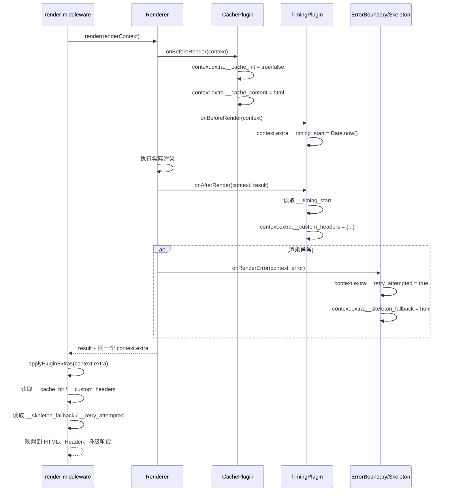

# 插件系统

Nami 的插件系统参考 Vite 的设计，支持构建、服务端、客户端三个阶段的全生命周期钩子。本文档从使用到原理，全面讲解插件机制。

读完后你将能够：
- 编写自己的 Nami 插件
- 理解三种钩子模式的区别和使用场景
- 利用 `context.extra` 实现插件间通信
- 正确管理插件的资源生命周期

---

## 1. 插件接口

每个插件必须实现 `NamiPlugin` 接口：

```typescript
interface NamiPlugin {
  name: string;              // 唯一标识
  version?: string;          // 版本号
  enforce?: 'pre' | 'post'; // 执行顺序控制
  setup: (api: PluginAPI) => void | Promise<void>;
}
```

### enforce 执行顺序

```
enforce: 'pre'  →  无 enforce（normal）  →  enforce: 'post'
  缓存插件              业务插件              监控插件
  (最先执行)                                (最后执行)
```

## 2. 编写一个插件

### 最小示例

```typescript
import type { NamiPlugin } from '@nami/shared';

export class MyPlugin implements NamiPlugin {
  name = 'my-plugin';
  version = '1.0.0';

  setup(api) {
    const logger = api.getLogger();

    api.onBeforeRender(async (context) => {
      logger.info('渲染即将开始', { url: context.url });
    });

    api.onAfterRender(async (context, result) => {
      logger.info('渲染完成', {
        url: context.url,
        duration: result.meta.duration,
        mode: result.meta.renderMode,
      });
    });
  }
}
```

### 完整示例：请求耗时统计插件

```typescript
import type { NamiPlugin, RenderContext, RenderResult } from '@nami/shared';

interface TimingPluginOptions {
  slowThreshold?: number; // 慢请求阈值（毫秒）
}

export class TimingPlugin implements NamiPlugin {
  name = 'timing-plugin';
  version = '1.0.0';
  enforce = 'pre' as const; // 在其他插件之前记录开始时间

  private slowThreshold: number;

  constructor(options: TimingPluginOptions = {}) {
    this.slowThreshold = options.slowThreshold ?? 3000;
  }

  setup(api) {
    const logger = api.getLogger();
    const config = api.getConfig();

    // 渲染前：记录开始时间
    api.onBeforeRender(async (context: RenderContext) => {
      context.extra.__timing_start = Date.now();
    });

    // 渲染后：计算耗时并上报
    api.onAfterRender(async (context: RenderContext, result: RenderResult) => {
      const start = context.extra.__timing_start as number;
      const duration = Date.now() - start;

      if (duration > this.slowThreshold) {
        logger.warn('慢请求检测', {
          url: context.url,
          duration,
          threshold: this.slowThreshold,
          renderMode: result.meta.renderMode,
        });
      }

      // 通过 extra 传递数据给中间件
      context.extra.__custom_headers = {
        'X-Render-Duration': String(duration),
      };
    });

    // 渲染错误：记录异常
    api.onRenderError(async (context, error) => {
      logger.error('渲染失败', {
        url: context.url,
        error: error.message,
      });
    });

    // 服务启动通知
    api.onServerStart(async ({ port, host }) => {
      logger.info(`TimingPlugin 已就绪，监听 ${host}:${port}`);
    });

    // 清理资源
    api.onDispose(async () => {
      logger.info('TimingPlugin 正在清理...');
    });
  }
}
```

## 3. 所有钩子一览

### 构建阶段

| 钩子 | 类型 | 说明 | 典型用途 |
|------|------|------|---------|
| `modifyWebpackConfig` | Waterfall | 修改 Webpack 配置 | 添加 loader/plugin/别名 |
| `modifyRoutes` | Waterfall | 修改路由配置 | 动态注入路由 |
| `onBuildStart` | Parallel | 构建开始通知 | 清理临时文件 |
| `onBuildEnd` | Parallel | 构建结束通知 | 生成额外文件 |

**Waterfall 示例 — 修改 Webpack 配置：**

```typescript
api.modifyWebpackConfig((config, { isServer, isDev }) => {
  if (!isServer) {
    config.resolve.alias['@components'] = path.resolve('src/components');
  }
  return config; // 必须返回修改后的配置
});
```

**Waterfall 示例 — 注入路由：**

```typescript
api.modifyRoutes((routes) => {
  routes.push({
    path: '/admin',
    component: './pages/admin',
    renderMode: 'csr',
  });
  return routes;
});
```

### 服务端阶段

| 钩子 | 类型 | 说明 | 典型用途 |
|------|------|------|---------|
| `onServerStart` | Parallel | 服务启动成功 | 初始化外部连接 |
| `onRequest` | Parallel | 请求到达 | 请求日志、鉴权 |
| `onBeforeRender` | Parallel | 渲染前 | 预处理、缓存检查 |
| `onAfterRender` | Parallel | 渲染后 | 指标采集、后处理 |
| `onRenderError` | Parallel | 渲染错误 | 错误上报 |
| `addServerMiddleware` | — | 注入 Koa 中间件 | 自定义中间件 |

**中间件注入示例：**

```typescript
api.addServerMiddleware(async (ctx, next) => {
  const token = ctx.headers['authorization'];
  if (!token) {
    ctx.status = 401;
    ctx.body = { error: 'Unauthorized' };
    return;
  }
  ctx.state.userId = verifyToken(token);
  await next();
});
```

### 客户端阶段

| 钩子 | 类型 | 说明 | 典型用途 |
|------|------|------|---------|
| `onClientInit` | Parallel | 客户端初始化 | SDK 初始化 |
| `wrapApp` | Waterfall | 包裹根组件 | Provider 注入 |
| `onHydrated` | Parallel | Hydration 完成 | 性能指标采集 |
| `onRouteChange` | Parallel | 路由切换 | 页面埋点 |

**wrapApp 示例：**

```typescript
api.wrapApp((app) => (
  <ThemeProvider theme={darkTheme}>
    <IntlProvider locale="zh-CN">
      {app}
    </IntlProvider>
  </ThemeProvider>
));
```

### 通用钩子

| 钩子 | 类型 | 说明 |
|------|------|------|
| `onError` | Parallel | 任意阶段的未捕获错误 |
| `onDispose` | Parallel | 插件销毁（热更新或停机） |

## 4. 钩子执行模式深度解析

### Waterfall（瀑布流）

```
initialValue → Plugin A → result A → Plugin B → result B → final result
```

- 前一个插件的输出是下一个的输入
- 如果插件返回 `undefined`，保持上一个值（容错）
- 单个插件失败：跳过该插件，用上一个值继续

```typescript
// PluginManager 内部实现
async runWaterfallHook<T>(hookName, initialValue, ...args): Promise<T> {
  let currentValue = initialValue;
  for (const handler of handlers) {
    try {
      const result = await handler.fn(currentValue, ...args);
      if (result !== undefined) currentValue = result;
    } catch (error) {
      this.handleHookError(hookName, handler.pluginName, error);
      // 继续下一个，不中断
    }
  }
  return currentValue;
}
```

### Parallel（并行）

```
                ┌→ Plugin A ──┐
args ──────────├→ Plugin B ──├→ Promise.allSettled → 统计失败数
                └→ Plugin C ──┘
```

- 所有处理器并发执行（`Promise.allSettled`）
- 单个失败不影响其他
- 失败数量记入日志

### Bail（短路）

```
args → Plugin A (返回 null) → Plugin B (返回 result) → 停止，返回 result
```

- 顺序执行，第一个返回非空值即为最终结果
- 后续处理器不再执行

## 5. 插件间数据传递：context.extra

`RenderContext.extra` 是一个 `Record<string, unknown>` 对象，是插件间以及插件与中间件之间的数据通道。同一个请求内，渲染器、各个插件钩子、`render-middleware` 拿到的是同一个 `RenderContext`，因此前面的写入可以被后面的阶段读取。



可以把它理解成一次请求里的“共享小黑板”：

- 插件在不同生命周期把数据写到 `context.extra`
- 后续插件或中间件从 `context.extra` 读取约定字段
- `render-middleware` 最终把这些字段映射为 HTTP 响应行为

### 约定的 extra 键名

| 键名 | 写入方 | 读取方 | 说明 |
|------|--------|--------|------|
| `__cache_hit` | cache 插件 | render-middleware | 缓存命中标记 |
| `__cache_content` | cache 插件 | render-middleware | 缓存内容 |
| `__skeleton_fallback` | skeleton 插件 | render-middleware | 骨架屏 HTML |
| `__custom_headers` | 任意插件 | render-middleware | 自定义响应头 |
| `__retry_attempted` | error-boundary 插件 | render-middleware | 是否已重试 |

## 6. 官方插件

### @nami/plugin-cache

```typescript
new NamiCachePlugin({
  strategy: 'lru',     // 'lru' | 'ttl'
  maxSize: 100,        // LRU 最大条目数
  ttl: 300,            // TTL 缓存超时（秒）
})
```

功能：`onBeforeRender` 读缓存 → `onAfterRender` 写缓存 + 生成 `Cache-Control`（含 CDN 策略）。

### @nami/plugin-monitor

```typescript
new NamiMonitorPlugin({
  reportUrl: 'https://monitor.example.com/collect',
  sampleRate: 0.1,     // 10% 采样
})
```

功能：性能采集（`PerformanceCollector`）、错误采集（`ErrorCollector`）、渲染指标（`RenderMetricsCollector`）、定时 flush 到 `BeaconReporter`。

### @nami/plugin-request

```typescript
new NamiRequestPlugin({
  baseURL: 'https://api.example.com',
  timeout: 5000,
  retry: { maxRetries: 2 },
})
```

功能：同构请求客户端、拦截器链（缓存→重试→超时）、`useRequest` hook、`usePagination` / `useCursorPagination`。

### @nami/plugin-skeleton

```typescript
new NamiSkeletonPlugin({
  layouts: ['list', 'detail', 'dashboard'],
})
```

功能：`wrapApp` 注入 Suspense fallback、渲染错误时生成骨架屏 HTML 写入 `context.extra.__skeleton_fallback`。

### @nami/plugin-error-boundary

```typescript
new NamiErrorBoundaryPlugin({
  maxRetries: 2,
  fallbackPages: { 404: CustomNotFound },
})
```

功能：`wrapApp` 包裹 `RouteErrorBoundary`、渲染错误时执行 `RetryStrategy` + `DegradeStrategy`。

## 7. 插件生命周期时序

```
=== 构建阶段 ===
PluginManager.registerPlugins()  ← 按 enforce 排序后依次 setup()
  │
modifyRoutes(routes)             ← waterfall
modifyWebpackConfig(config)      ← waterfall
onBuildStart()                   ← parallel
  ... webpack 编译 ...
onBuildEnd()                     ← parallel

=== 服务启动阶段 ===
createNamiServer()
  │
  ├── 注册插件 → setup()
  ├── getServerMiddlewares() → 注入 Koa 管线
  │
startServer()
  │
  └── onServerStart({ port, host })  ← parallel

=== 请求处理阶段 (每次请求) ===
onRequest(ctx)           ← parallel (如果注册了)
onBeforeRender(context)  ← parallel
  ... 渲染 ...
onAfterRender(context, result)  ← parallel
  [失败时] onRenderError(context, error)  ← parallel

=== 客户端阶段 ===
initNamiClient()
  │
  ├── 注册插件 → setup()
  ├── onClientInit()     ← parallel
  ├── wrapApp(element)   ← waterfall
  ├── hydrateRoot()
  ├── onHydrated()       ← parallel
  │
  └── 路由切换时 onRouteChange({ from, to })  ← parallel

=== 停机阶段 ===
onDispose()              ← parallel (所有插件)
```

## 8. 最佳实践

### 命名规范

- 插件 name 使用 kebab-case：`my-auth-plugin`
- 类名使用 PascalCase：`MyAuthPlugin`
- extra 键名使用 `__` 前缀防冲突：`__auth_token`

### 错误处理

```typescript
api.onBeforeRender(async (context) => {
  try {
    // 插件逻辑
  } catch (error) {
    // 插件内部处理错误，不要让异常逃逸到钩子链
    logger.warn('插件操作失败，已降级跳过', { error });
  }
});
```

### 资源清理

```typescript
setup(api) {
  const connection = createDatabaseConnection();

  api.onDispose(async () => {
    await connection.close(); // 务必清理外部资源
  });
}
```

### 配置只读

`api.getConfig()` 返回的是冻结对象（`Object.freeze`），不可直接修改。需要修改配置请使用 `modifyWebpackConfig` 或 `modifyRoutes` 钩子。

## 9. 常见模式与注意事项

### 条件执行（按渲染模式）

```typescript
api.onBeforeRender(async (context) => {
  // 只在 SSR 模式下执行
  if (context.renderMode !== 'ssr') return;
  // ... SSR 特有逻辑
});
```

### 插件间依赖

如果你的插件依赖另一个插件先执行，使用 `enforce` 控制顺序：

```typescript
// 缓存插件 — 需要在其他插件之前检查缓存
class CachePlugin implements NamiPlugin {
  enforce = 'pre' as const;  // 最先执行
  // ...
}

// 监控插件 — 需要在其他插件之后采集完整指标
class MonitorPlugin implements NamiPlugin {
  enforce = 'post' as const;  // 最后执行
  // ...
}
```

### 避免的反模式

```typescript
// ❌ 在 Waterfall 钩子中忘记返回值
api.modifyRoutes((routes) => {
  routes.push({ path: '/admin', component: './admin' });
  // 忘记 return routes！结果下一个插件拿到 undefined
});

// ✅ Waterfall 钩子必须返回修改后的值
api.modifyRoutes((routes) => {
  routes.push({ path: '/admin', component: './admin' });
  return routes;
});
```

```typescript
// ❌ 在钩子中抛出异常中断整个流程
api.onBeforeRender(async (context) => {
  const data = await riskyOperation();  // 可能抛异常
  context.extra.__my_data = data;
});

// ✅ 内部 try/catch，失败时优雅降级
api.onBeforeRender(async (context) => {
  try {
    context.extra.__my_data = await riskyOperation();
  } catch (error) {
    logger.warn('数据获取失败，已跳过', { error });
    // 不设置 extra，下游代码应做 null 检查
  }
});
```

### 调试技巧

1. 使用 `api.getLogger()` 而非 `console.log` — 插件日志会带上插件名前缀，方便追踪
2. 在 `onAfterRender` 中检查 `result.meta` 可以获取渲染耗时、渲染模式等信息
3. 在开发模式下，所有插件钩子的执行耗时会打印到 debug 日志

---

## 下一步

- 想了解中间件管线如何消费插件数据？→ [服务器与中间件](./server-and-middleware.md)
- 想了解路由系统？→ [路由系统](./routing.md)
